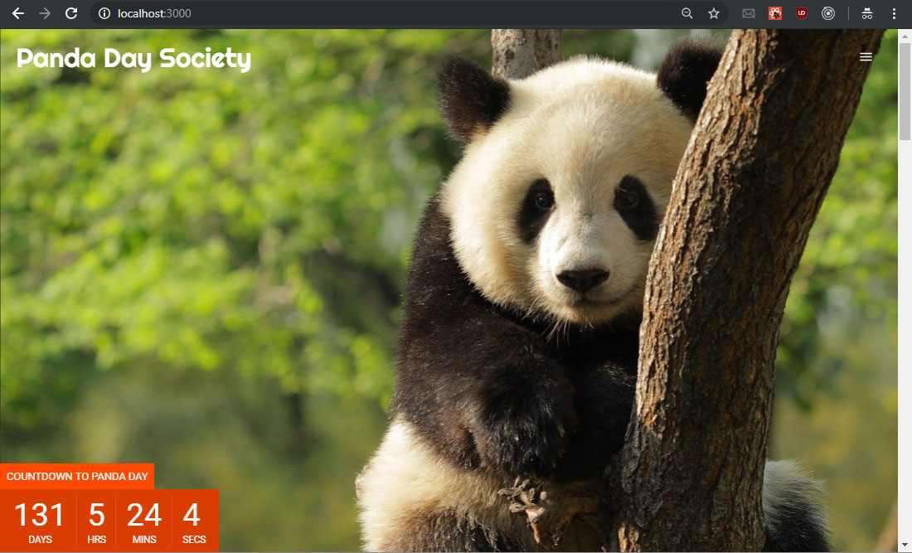

# ReactJS-Panda-Day

***

\[**Description**\]
* This is a Panda themed web app.  Main feature is a countdown to Panda Day (every March 16th) with an image carousel at the top.  There's also a party info, fun facts, merchandise, point of interest, and footer section - all with various animations.

***

\[**Technologies**\]
* ReactJS, react-reveal, react-slick, react-scroll
* @material-ui

***

\[**How to Run**\]
1. clone/download repo.
2. go to folder path and npm install.
3. npm start

* Or visit deployment link: https://vyeung.github.io/ReactJS-Panda-Day/